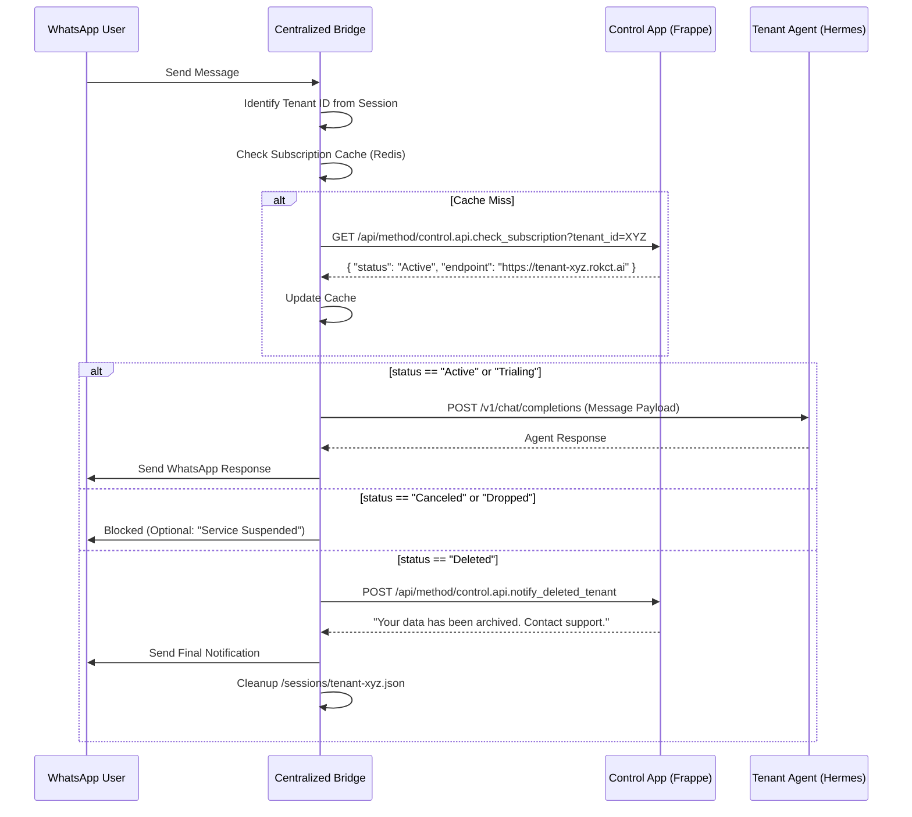

# Architecture Design: Centralized WhatsApp Bridge & Tenant Routing (done)

This document defines the technical architecture for the centralized Rokct.ai WhatsApp bridge, integrating subscription management and multi-tenant routing.

## 1. Component Overview

*   **Centralized Baileys Bridge (CBB):** A unified Node.js service (based on the Hermes Baileys bridge) that manages multiple WhatsApp sessions. It acts as a smart router.
*   **Control App (Frappe):** The authoritative source for `Company Subscription` status and tenant metadata.
*   **Tenant Agent (Hermes v0.7.0):** Individual Hermes instances running in `api-server` mode inside isolated tenant Docker containers/VPS.

## 2. The Routing Flow

## 3. Implementation Details

### A. Centralized Bridge (Node.js)
*   **Session Management:** Sessions are stored as files: `/sessions/{tenant_id}.json`.
*   **X-Hermes-Session-Id:** The bridge will map the WhatsApp `remoteJid` to the `X-Hermes-Session-Id` header when calling the tenant's API server to ensure session continuity. [DONE]
*   **Internal Health:** A `/health` endpoint that reports the status of all active tenant sessions to the Control app.

### B. Control App APIs (Python)
*   `check_subscription(tenant_id)`:
    - Returns current status from `Company Subscription`.
    - Returns the tenant's specific VPS/Docker API endpoint.
*   `notify_deleted_tenant(tenant_id)`:
    - Returns a standardized message (Jinja-templated) for users whose accounts have been removed.

### C. Tenant Agent Configuration (Hermes)
*   **Mode:** `hermes api-server --port 8000`.
*   **Auth:** Secured by a platform-wide shared secret or tenant-specific API keys managed by Control.
*   **Memory:** Uses the `RokctMemoryProvider` (see Spec #2) to talk to the local `brain` app.

## 4. Multi-Tenant Scaling Strategy
*   **Lightweight Bridge:** One CBB process can handle dozens of concurrent Baileys sessions before requiring horizontal scaling.
*   **Failover:** If a tenant VPS is unreachable, the CBB logs the error to the Control app's `API Error Log` and notifies the user.
*   **Subscription Reminders:** The Control app can trigger proactive messages via the CBB's `/send` endpoint even if the Tenant Agent is offline (due to non-payment).

---
*End of Specification*
