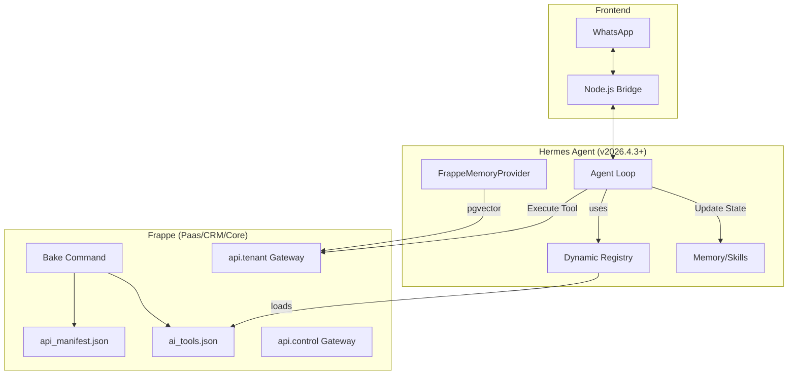

# Integration Architecture: Frappe Core & Hermes Agent (done)

This document outlines the high-level architecture for integrating your `rcore` platform with Hermes Agent to build a dynamic, self-improving AI service.

## 1. System Overview

The integration uses Frappe as the **Business Logic & Identity** layer and Hermes as the **Intelligence & Interaction** layer.

## 2. Key Components

### A. The "Bake" Bridge
Your current `manager.bake_assets()` is the critical link. It ensures that the Agent's understanding of its capabilities (Tools) is always perfectly synced with your latest backend code.

### B. Multi-Tenant Routing & Credential Pools
With Hermes v0.7.0, you can leverage native multi-tenancy features:

-   **`FrappeMemoryProvider` (Pluggable Memory):** Instead of using flat files, the agent stores memories directly in your Frappe PostgreSQL database using **pgvector**. v0.7.0 limits to **one external provider**, so this provider becomes the authoritative memory source for your stack.
-   **Tenant Scoping:** Every memory search query is filtered by `tenant_id`, ensuring a user in Tenant A never "remembers" a fact from Tenant B.
-   **Credential Pools:** Use v0.7.0's **Same-Provider Credential Pools** to manage multiple API keys for different tenants within a single Hermes instance, allowing for lightweight scale.

### C. The Self-Improving Loop (Legacy & Career)
This is where Hermes shines for your "Life Manager" goal:
1.  **Achievement Unlocked:** A user tells the Agent (via WhatsApp): "I just finished the marathon in 4 hours."
2.  **Tool Execution:** The Agent calls `crm:log_achievement(title="Marathon", time="4h")`.
3.  **Memory Update:** The Agent also updates its internal `USER.md` memory: "User is a runner, marathon PB is 4h."
4.  **Skill Creation:** If the Agent needs to write a CV later, it sees this achievement in memory. It can even autonomously create a "CV Writing Skill" that specifically knows how to format these Frappe-logged achievements.

## 3. Deployment Strategy

For your "offering different services" requirement:

| Service Level | Hermes Configuration | Frappe Role |
| :--- | :--- | :--- |
| **Personal (Life Mgr)** | Full Tool Access, Deep Memory | Tenant |
| **Business (Invoice Mgr)** | Restricted to `paas:` tools | Tenant |
| **Admin (Platform Mgr)** | `control:` tools enabled | Control |

By simply toggling which "Toolsets" or "Skills" are loaded into the Hermes session based on the user's subscription, you can offer vastly different experiences using the same underlying engine.

## 4. Porting Roadmap (v0.7.0 Native)

1.  **Phase 1: Gateway & Resilience:** Deploy the Hermes v0.7.0 Gateway. Evaluate the native WhatsApp bridge against your TypeScript bridge. v0.7.0's hardened media delivery and approval routing make the native bridge a strong candidate. [DONE]
2.  **Phase 2: Dynamic Tooling & Diffs:** Implement the `FrappeDynamicToolset` (see `DYNAMIC_FRAPPE_TOOLS.md`). Use v0.7.0's **Inline Diff Previews** to ensure the agent's "baked" changes are visible and safe.
3.  **Phase 3: Multi-Tenant Memory:** Implement the **`FrappeMemoryProvider`** plugin using `pgvector`. This replaces the need for Honcho and centralizes memory in your `rPanel` database.
4.  **Phase 4: Scalable Auth:** Configure **Credential Pools** for your tenants' inference keys, allowing you to serve multiple users from a single resilient gateway.
5.  **Phase 5: Life Manager Skills:** Port your architectural mapping and "Monday Planning" logic as Hermes **Skills**, utilizing **Camofox** for any required web research.
